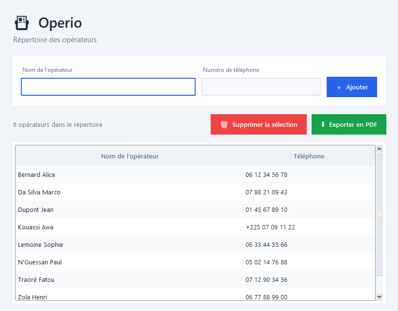

# 📇 Operio — Répertoire des opérateurs

Petite application de bureau **Python + Tkinter** pour gérer une liste
d'opérateurs (nom + numéro de téléphone), l'afficher **triée par ordre
alphabétique** et l'**exporter en PDF** d'un clic.

Conçue pour automatiser une tâche de bureau simple : tenir à jour un annuaire
propre et l'imprimer/partager facilement.



---

## ✨ Fonctionnalités

- ➕ **Ajouter un opérateur** — nom + numéro de téléphone (validation légère du numéro)
- 🔤 **Tri alphabétique automatique** du tableau par nom
- 🗑️ **Supprimer** une ou plusieurs lignes sélectionnées (touche `Suppr`)
- 📄 **Export PDF** d'un joli tableau numéroté, avec titre et date
- 💾 **Sauvegarde automatique** dans `operateurs.json` (les données sont conservées entre deux ouvertures)
- 🚫 **Détection des doublons** et avertissement sur les numéros inhabituels
- 🎨 **Interface claire et moderne** (thème blanc, accents bleus)

### ⌨️ Raccourcis clavier

| Raccourci | Action |
|-----------|--------|
| `Entrée`  | Ajouter l'opérateur saisi |
| `Suppr`   | Supprimer la sélection |
| `Ctrl + S`| Exporter en PDF |

---

## 🚀 Installation

> Prérequis : **Python 3.10+** (Tkinter est inclus avec Python sous Windows).

```bash
# 1. Cloner le dépôt
git clone https://github.com/Dipeua/Operio.git
cd Operio

# 2. Installer la dépendance pour l'export PDF
pip install -r requirements.txt
```

## ▶️ Lancement

```bash
python operio.py
```

---

## 📁 Structure du projet

```
sabeni-app/
├── operio.py          # L'application
├── requirements.txt   # Dépendances (reportlab pour le PDF)
├── _capture.py        # Script utilitaire pour générer la capture d'écran
├── docs/
│   └── operio.png     # Aperçu de l'application
├── LICENSE
└── README.md
```

> `operateurs.json` est créé automatiquement au premier ajout et contient vos
> données. Il est ignoré par Git (voir `.gitignore`).

---

## 🛠️ Construit avec

- [Python](https://www.python.org/) & [Tkinter](https://docs.python.org/3/library/tkinter.html) — interface graphique
- [ReportLab](https://www.reportlab.com/) — génération des PDF

---

## 📜 Licence

Distribué sous licence **MIT**. Voir le fichier [LICENSE](LICENSE).

© 2026 **Dipeua Berthold**
